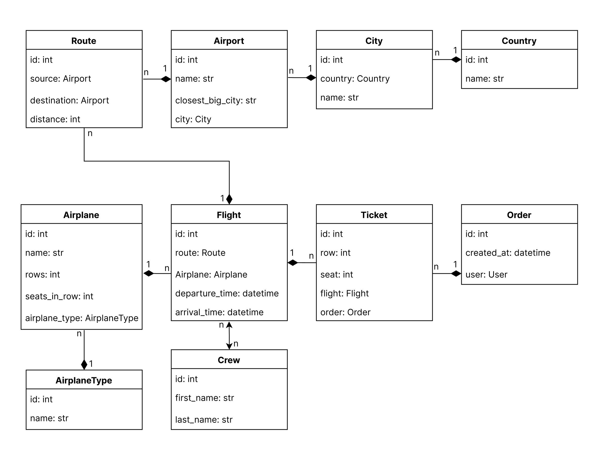

# Airport API Service

___
This project is an Airport API Service built with Django and Docker. It provides RESTful APIs for managing various
entities, including Countries, Cities, Airplane Types, Airplanes, Airports, Routes, Crew, Flights, Users, and Orders.

## Running with Docker

To run the project with Docker, follow these steps:

1. Run the following commands line by line:

    ```bash
    docker pull loplicat/airport-api-service
    ```
   ```bash
    docker-compose up
    ```

2. Access the API endpoints via `http://localhost:8001/`.

## Running on your machine

1. Ensure you have Python installed (preferably version 3.7 or later).

2. Clone the repository:

    ```bash
    git clone https://github.com/loplicat/airport-api-service.git
    ```

3. Navigate to the project directory:

    ```bash
    cd airport-api-service
    ```

4. Install the Python dependencies:

    ```bash
    pip install -r requirements.txt
    ```

5. Uncomment DATABASES settings in airport_system/settings.py for sqlite and comment postgresql settings.

6. Apply database migrations:

    ```bash
    python manage.py migrate
    ```

7. Use this command to load prepared data from the fixture:

   ```bash
    python manage.py loaddata airport_service_db_data.json
    ```
8. Run the development server:

    ```bash
    python manage.py runserver
    ```

9. Access the API endpoints via `http://localhost:8000/`.

10. After loading data from the fixture you can use the following superuser:

    ```
    login: admin.user
    password: 1qazcde3
    ```

## Swagger/Redoc Documentation:

- `localhost/api/doc/swagger/`

Provides the **Swagger UI** interface for interactive documentation of the API endpoints. Developers can explore and test the endpoints directly from the browser.

- `localhost/api/doc/redoc/`

Offers the **Redoc** interface for API documentation, providing an alternative layout and styling for viewing and interacting with the API documentation.

## API Endpoints

Below is a list of the API endpoints provided by the project:

- **Countries**: `/api/airport/countries/`
- **Cities**: `/api/airport/cities/`
- **Airplane Types**: `/api/airport/airplane_types/`
- **Airplanes**: `/api/airport/airplanes/`
- **Crews**: `/api/airport/crews/`
- **Airports**: `/api/airport/airports/`
- **Routes**: `/api/airport/routes/`
- **Flights**: `/api/airport/flights/`
- **Orders**: `/api/airport/orders/`
- **Users**: `/api/user/register`,`/api/user/me` `/api/user/token`, `/api/user/token/refresh`, `/api/user/token/verify`

Each endpoint supports a range of operations, including listing and creating. Some of them provide operations of retrieving, updating, and filtering.


## Main features
1. JWT Authentication
2. Email-Based Authentication
3. Admin panel
4. Throttling settings
5. API Swagger and Redoc documentation
6. Uploading images of airplanes
7. Filtering for Airplanes, Flights, and Routs endpoints
8. Implemented a custom permission class


## DB Structure


